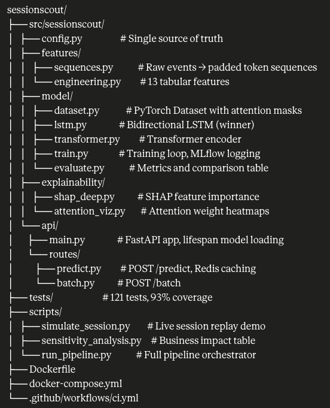

# SessionScout 🔍

> Real-time e-commerce session conversion scoring engine

[](https://github.com/MohammedAhmeduddin/sessionscout/actions/workflows/ci.yml)


SessionScout predicts whether an active browsing session will convert to a purchase — before the user leaves — so e-commerce sites can intervene only where it matters.

---

## The problem

72% of e-commerce sessions abandon. Most retargeting tools fire the same discount at every abandoning user. But there are three types of leaving user:

- **Was always going to buy** — got a phone call, coming back. Sending a discount wastes money.
- **Genuinely hesitating** — added to cart, paused 5 minutes, came back to look again. A small nudge tips them over. **This is the target.**
- **Never going to buy** — price comparing, just browsing. No intervention works.

A rule-based system cannot tell them apart. SessionScout reads the **sequence of behavior** and scores the probability in real time.

---

## Results

| Model               | Val AUC    | Test AUC   | Notes                          |
| ------------------- | ---------- | ---------- | ------------------------------ |
| Logistic Regression | 0.9575     | 0.9573     | Tabular features baseline      |
| XGBoost             | 0.9748     | 0.9750     | Non-linear tabular baseline    |
| **LSTM (winner)**   | **0.9868** | **0.9883** | Sequence modeling              |
| Transformer         | 0.9814     | 0.9841     | Attention-based sequence model |

**Honest finding:** The LSTM beat the Transformer. Sessions have a median length of 7 events — too short for long-range attention to provide an advantage over sequential memory. This is documented, not hidden.

**Key SHAP drivers:** `n_carts` (2.23), `gap_ratio` (0.92), `cart_rate` (0.78)

**Attention pattern:** VIEW events attend strongly to ADD_CART (weight 0.56). ADD_CART attends to GAP_LONG (weight 0.32) — the hesitation pattern.

---

## Quickstart

```bash
# 1. Clone
git clone https://github.com/MohammedAhmeduddin/sessionscout.git
cd sessionscout

# 2. Install
python3 -m venv .venv && source .venv/bin/activate
pip install -e ".[dev]"

# 3. Download data (requires Kaggle credentials)
make download-all

# 4. Run pipeline
make pipeline-dev         # ~5 min, 50K OTTO sessions

# 5. Train all 4 models
make train

# 6. Start API
make api
# → http://localhost:8000/docs
```

---

## API

```bash
# Single session score
curl -X POST http://localhost:8000/api/v1/predict \
  -H "Content-Type: application/json" \
  -d '{"session_id": "user_001", "sequence": [1, 1, 2, 5, 1, 1]}'

# Response
{
  "session_id": "user_001",
  "conversion_probability": 0.697,
  "top_signals": ["VIEW×4", "ADD_CART×1", "GAP_LONG×1"],
  "cached": false,
  "latency_ms": 27.06
}
```

Token vocabulary: `PAD=0  VIEW=1  ADD_CART=2  PURCHASE=3  GAP_SHORT=4  GAP_LONG=5`

### Docker

```bash
docker-compose up --build
# API: http://localhost:8000
# Redis cache: localhost:6379
```

---

## Architecture


